# PPSActividad4Unidad1RaulAlbalatPerez

# Actividad: Prueba de Aplicaciones en Entornos Controlados

## Instrucciones

Realiza lo indicado y adjunta las capturas de pantalla o pruebas necesarias para documentar la realización de cada paso.

En esta actividad, trabajaremos sobre la prueba de aplicaciones en entornos controlados: **sandboxing** o cajas de arena.

Puedes conocer más sobre esta técnica y sus diferentes alternativas en el siguiente artículo:  
🔗 [¿Qué es el sandboxing de aplicaciones?](https://www.hysolate.com/learn/sandboxing/what-is-app-sandboxing/)

## Objetivo de la Actividad

La actividad consiste en probar la aplicación de la **calculadora** (que realizaste en una actividad anterior) en un entorno controlado. Si no tienes la aplicación terminada, puedes utilizar la que se encuentra adjunta en la tarea.

## Pasos a Seguir

# 1.  Busca cuáles son las distintas alternativas disponibles para probar esta aplicación en una **Sandbox**.

   ## **Primera opción(que es la que desarrollo)**

###  Firejail (Linux)
- **Descripción:** Es un entorno de aislamiento para aplicaciones en Linux que utiliza namespaces y seccomp para restringir los privilegios.
- **Ventajas:**
  - Ligero y fácil de usar.
  - Compatible con muchas aplicaciones sin necesidad de modificaciones.
  - Control de permisos mediante perfiles configurables.
- **Uso básico:**  
  ```bash
  firejail ./calculadora.py

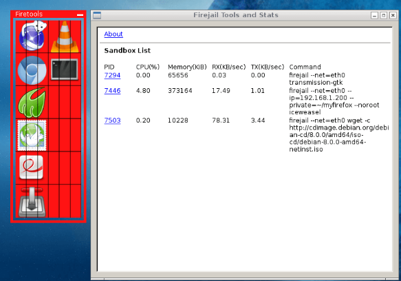
---
## **Segunda opción**
###  Windows Sandbox (Windows 10/11 Pro)
- **Descripción:** Un entorno aislado dentro de Windows que permite ejecutar aplicaciones sin afectar el sistema principal.
- **Ventajas:**
  - No requiere configuraciones complejas.
  - Se restablece con cada uso (cualquier cambio desaparece al cerrarlo).
- **Activación en Windows (si no está activado):**
  ```powershell
  Enable-WindowsOptionalFeature -FeatureName "Containers-DisposableClientVM" -Online -NoRestart
  ```

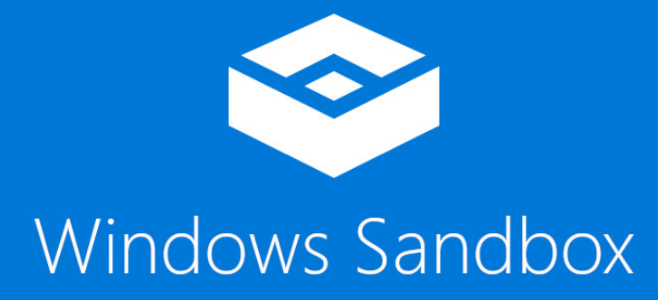

Adjunto [enlace activar windows sandbox](https://www.xataka.com/basics/windows-sandbox-que-como-activarlo)
---
## **Tercera opción**

###  VirtualBox o VMware (Máquinas Virtuales)
- **Descripción:** Plataformas de virtualización que permiten ejecutar sistemas operativos aislados.
- **Ventajas:**
  - Máxima seguridad y aislamiento.
  - Permite probar en distintos sistemas operativos.
- **Uso recomendado:**  
  - Crear una VM con el sistema operativo adecuado.
  - Instalar dependencias necesarias y probar la calculadora dentro de la VM.

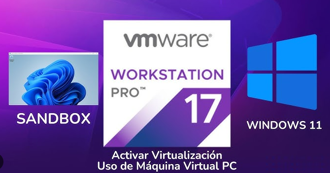

Adjunto [como habilitar Windows Sandbox en vmware](https://www.redeszone.net/2019/01/23/habilitar-windows-sandbox-vmware/)
----
## **Cuarta opción**

###  Docker (Contenedores Aislados)  con cuckoo sandbox
- **Descripción:** Plataforma para ejecutar aplicaciones en contenedores con su propio entorno.
- **Ventajas:**
  - Aislamiento sin necesidad de una VM completa.
  - Fácil de desplegar en distintos sistemas.
- **Ejemplo de ejecución de la calculadora en un contenedor Ubuntu:**
  ```bash
  docker run --rm -it ubuntu bash
  ```

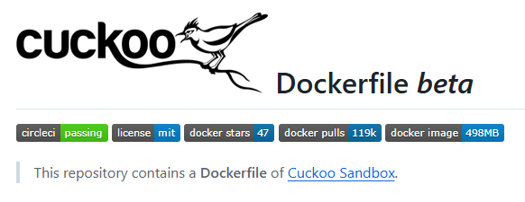

Adjunto [enlace a repositorio de cuckoo](https://github.com/blacktop/docker-cuckoo)


# 2.  Crea el entorno controlado

Voy a realizar la practica con **firejail** en una máquina virtual **Ubuntu22.04** la cual la he instalado para realizar esta práctica

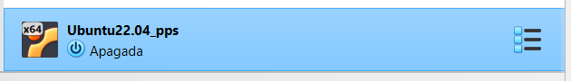

## Paso 1. Actualizar los paquetes e instalar firejail

Para ello voy a ejecutar en la terminal de ubuntu el siguiente comando.
~~~
sudo apt update && sudo apt install firejail -y
~~~ 

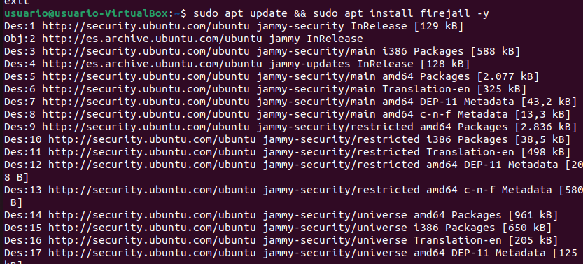

Tambien para asegurarse que funciona bien firejail voy a ejecutar un **upgrade**

~~~
sudo apt upgrade
~~~ 

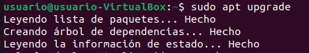

## Paso 2. comprobar que se ha instalado y ejecutarlo.

Para ello probamos ejecutando la version que de firejail.

~~~
firejail --version
~~~

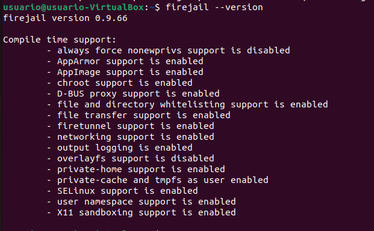

## Paso 3. Descargo la calculadora facilitada en la practica por le profesor.

Me descargo la ***claculadoraBasica.py*** y me la paso al home del usuario de ubuntu para facilitar la ruta de ejecución.

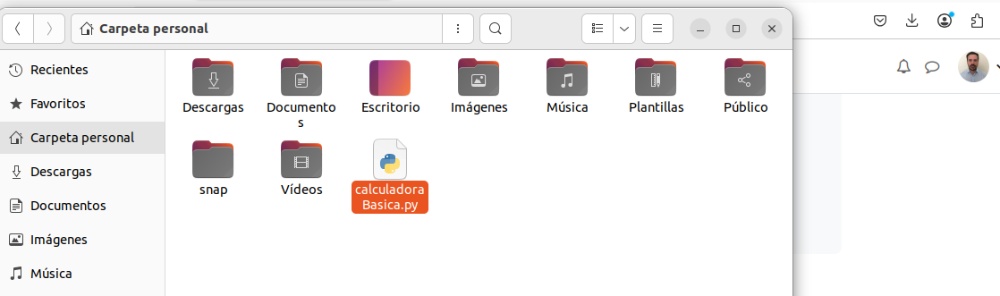


## Paso 4. Ejecutamos firejail

Comporbamos si Python3 está instalado para poder ejecutar la calculadora.

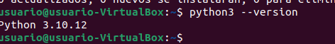

Ahora procedemos a ejecutar firejail con la calculadora. Al probarlo vemos que no se ejecuta correctamente. debe de ser algun conflicto con la shell de ubuntu. Para solucionarlo probaremos instalando una nueva consola **konsole**. 

Vemos que la ***calculadoraBasica.py*** se ejecuta en entorno seguro. Pero voy a instalar la aplicacion **firetools** que tiene un entorno gráfico, el cual es más sencillo de monitorizar el PID que nos genere.

~~~
sudo apt install firetools -y
~~~

Con esto ya nos generará una aplicación que podemos acceder a ella desde las aplicaciones.

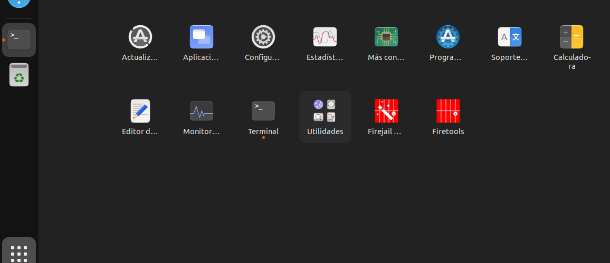

Ahora procedemos a ejecutar **firejail** con la calculadora. Al probarlo vemos que no se ejecuta correctamente. debe de ser algun conflicto con la shell de ubuntu. Para solucionarlo probaremos instalando una nueva consola **konsole**. y volvemos a ejecutar firejail

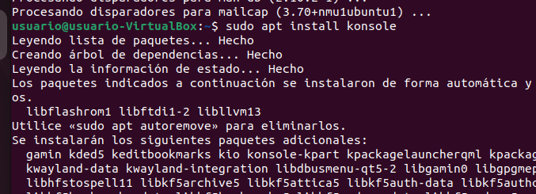

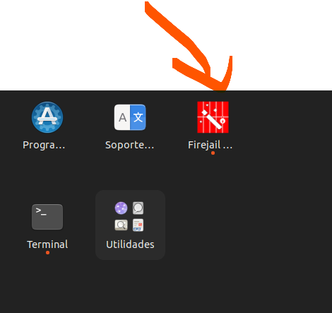

Ponemos la ruta de la consola que queremos ejecutar

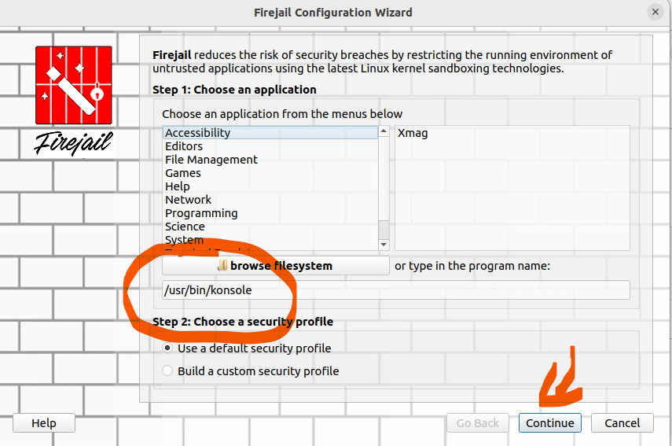

Le decimos que monitore con la opcion **Sandbox monitoring and stadistics**


Se nos Abren dos ventanas. una con la consola que acabamos de instalar y otra cla ventana de firetools con el PID de la consola que hemos abierto. 

## 2. hemos creado ya el entorno controlado y ahora porbamos la aplicación en el.

- Para ello ejecutaremos la calculadora en la consola que tenemos abierta. Vemos para empezar que tenemos un **PID_48263** 

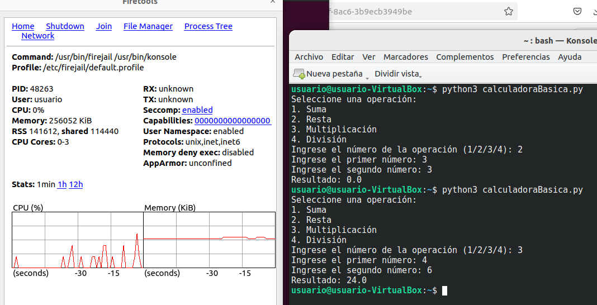

- Si pinchamos en el PID mientras ejecutamos la calculadora vemos la **CPU** que está consumiento asi como la **Memoria**. También vemos el usuario que está ejecutando el entorno seguro. En este caso se llama **Usuario**. 

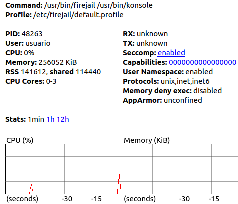

- Si pinchamos en **File Manager** podemos ver una las carpetas y archivos que se están ejecutando y que estla permitidos según las restricciones de Firejail. Haty archivos que incluso están bloqueados ***Blacklist***

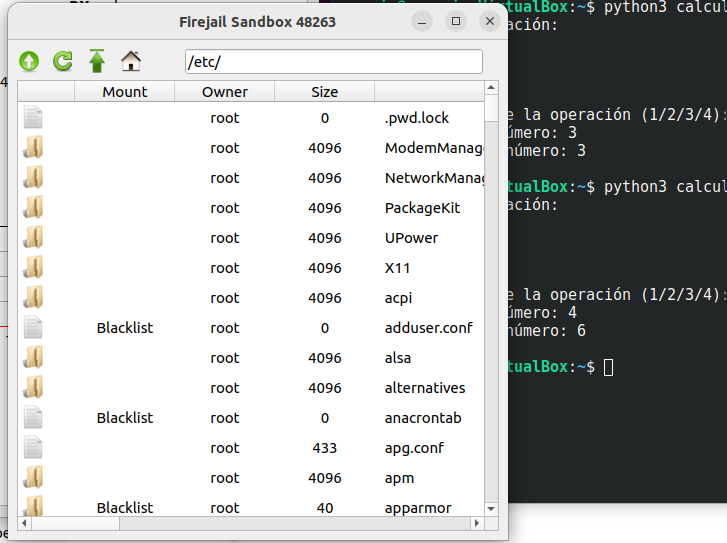

 Es útil para analizar cómo una aplicación interactúa con el sistema de archivos dentro del sandbox.

- Si pinchamos en **Process tree** nos permite ver un arbol de cuales son los procesos y subprocesos así como el PID ejecuado. Sería algo parecido a ***pstree*** en linux.

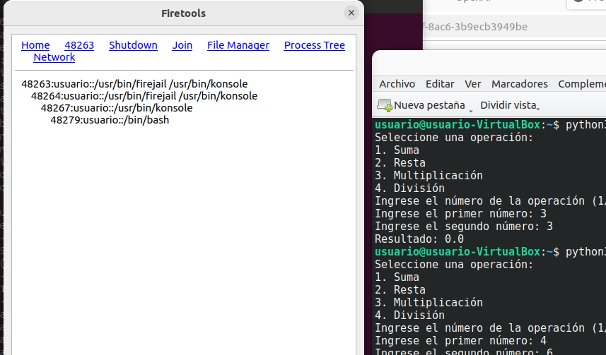

- Si pinchamos en **Network** nos permite supervisar y controlar el tráfico de red de las aplicaciones ejecutadas dentro del sandbox de Firejail. Muestra las conexiones de red establecidas y nos vale para analizar el comportamiento de red de las aplicaciones y detectar tráfico sospechoso.


