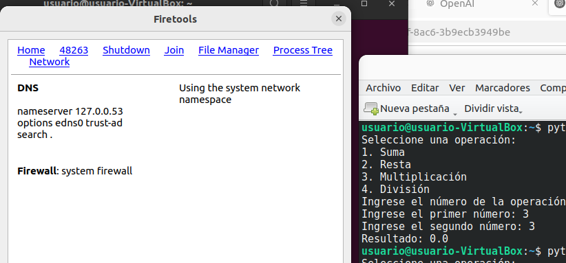

# PPSActividad4Unidad1RaulAlbalatPerez

Voy a realizar la practica con **firejail** en una máquina virtual **Ubuntu22.04** la cual la he instalado para realizar esta práctica

## Paso 1. Actualizar los paquetes e instalar firejail

Para ello voy a ejecutar en la terminal de ubuntu el siguiente comando.
~~~
sudo apt update && sudo apt install firejail -y
~~~ 

Tambien para asegurarse que funciona bien firejail voy a ejecutar un **upgrade**

~~~
sudo apt upgrade
~~~ 

## Paso 2. comprobar que se ha instalado y ejecutarlo.

Para ello probamos ejecutando la version que de firejail.

~~~
firejail --version
~~~

## Paso 3. Descargo la calculadora facilitada en la practica por le profesor.

Me descargo la ***claculadoraBasica.py*** y me la paso al home del usuario de ubuntu para facilitar la ruta de ejecución.

## Paso 4. Ejecutamos firejail

Comporbamos si Python3 está instalado para poder ejecutar la calculadora.

Ahora procedemos a ejecutar firejail con la calculadora. Al probarlo vemos que no se ejecuta correctamente. debe de ser algun conflicto con la shell de ubuntu. Para solucionarlo probaremos instalando una nueva consola **konsole**. 

Vemos que la ***calculadoraBasica.py*** se ejecuta en entorno seguro. Pero voy a instalar la aplicacion **firetools** que tiene un entorno gráfico, el cual es más sencillo de monitorizar el PID que nos genere.

~~~
sudo apt install firetools -y
~~~

Con esto ya nos generará una aplicación que podemos acceder a ella desde las aplicaciones.

Ahora procedemos a ejecutar **firejail** con la calculadora. Al probarlo vemos que no se ejecuta correctamente. debe de ser algun conflicto con la shell de ubuntu. Para solucionarlo probaremos instalando una nueva consola **konsole**. y volvemos a ejecutar firejail

Ponemos la ruta de la consola que queremos ejecutar

Le decimos que monitore con la opcion **Sandbox monitoring and stadistics**

Se nos Abren dos ventanas. una con la consola que acabamos de instalar y otra cla ventana de firetools con el PID de la consola que hemos abierto. 

## 2. hemos creado ya el entorno controlado y ahora porbamos la aplicación en el.

- Para ello ejecutaremos la calculadora en la consola que tenemos abierta. Vemos para empezar que tenemos un **PID_48263** 

- Si pinchamos en el PID mientras ejecutamos la calculadora vemos la **CPU** que está consumiento asi como la **Memoria**. También vemos el usuario que está ejecutando el entorno seguro. En este caso se llama **Usuario**. 

- Si pinchamos en **File Manager** podemos ver una las carpetas y archivos que se están ejecutando y que estla permitidos según las restricciones de Firejail. Haty archivos que incluso están bloqueados ***Blacklist***

 Es útil para analizar cómo una aplicación interactúa con el sistema de archivos dentro del sandbox.

- Si pinchamos en **Process tree** nos permite ver un arbol de cuales son los procesos y subprocesos así como el PID ejecuado. Sería algo parecido a ***pstree*** en linux.

- Si pinchamos en **Network** nos permite supervisar y controlar el tráfico de red de las aplicaciones ejecutadas dentro del sandbox de Firejail. Muestra las conexiones de red establecidas y nos vale para analizar el comportamiento de red de las aplicaciones y detectar tráfico sospechoso.

